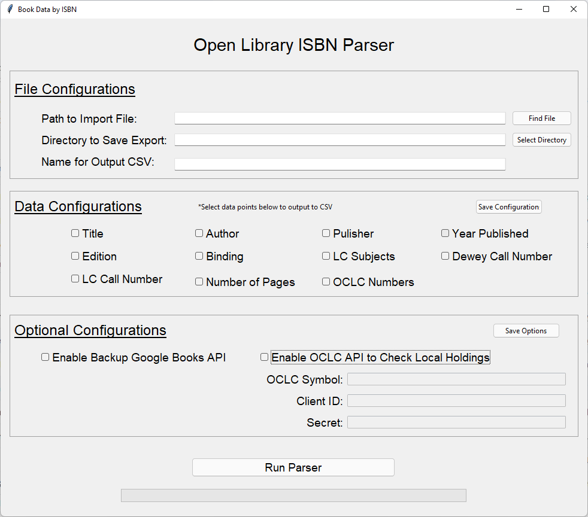

# Open Library ISBN Parser

**Table of Contents:**

1. [Overview](#overview)
	- [Version Info](#version-info)
    - [Video Walkthrough](#video-walkthrough)
	- [Description](#description)
	- [Requirements](#requirements)
	- [How to Use](#how-to-use)
1. [Installation](#installation)
	 - [Windows Installer](#windows-installer)
	 - [Run as a Script](#run-as-a-script)
1.  [Troubleshooting](#troubleshooting)
1. [License](#licence)

## **Overview**

### Version Info
Current Version: 1.0.5 -- Fixed bug in v1.0.0 that caused errors in author processing when data is returned in an unexpected format.  Fixed bug that broke the program when input csv column header is different from isbn (ie: ISBN, IsBn, etc, wouldn't work). Fix indexing bug when OCLC returns data in a layout the program wasn't expecting.  Fixed bug that would cause the wrong data to be populated under the wrong column names in the export CSV when saved Data Configs are run once, then new data are selected before running the program again.  Fixed minor typos and updated README with version number.  
Older Versions: 
	- 1.0.0 -- Initial Commit

### Video Walkthrough
Video demonstration coming soon

### Description
This program imports a csv file with a column of ISBNs and exports a new csv file with columns containing the following data points that can be selected by the user:
- Title
- Author
- Publisher
- Year Published
- Edition
- Binding
- LC Subject Headings
- Dewey Call Number
- LC Call Number
- Number of Pages
- OCLC Numbers
- How many copies are owned at a specific OCLC member library (Requires OCLC Membership, Worldcat Search API Credentials, and to have Enable OCLC API to Check Local Holdings checked in the Optional Configurations section) 


### Requirements
In order to run this program you will need the following:
- A reliable Internet connection

- If enabling OCLC WorldCat search you'll need [an OCLC Library Membership](https://www.oclc.org/en/membership/member-resources.html)
- If enabling OCLC WorldCat search you'll need [an OCLC Library Code](https://www.oclc.org/en/contacts/libraries.html)
- If enabling OCLC WorldCat search you'll need to [Request a Worldat Search API Key (This program uses Version 2 of the search api)](https://www.oclc.org/developer/api/oclc-apis/worldcat-search-api.en.html)

If you start the program as a Python script rather than installing it with the Windows Installer Provided in this repo you'll need to manually install software dependencies.  Starting the program in the terminal using Python will work on Linux, Mac, and Windows (see the section [Run as a Script](#run-as-a-script)).  The following software must be installed on your computer in order to start this program from the terminal:
- [Python3](https://www.python.org/downloads/)
- [pip](https://www.geeksforgeeks.org/download-and-install-pip-latest-version/)
- tkinter
	- Windows: tkinter is installed automatically when you install Python3 on Windows
	- Linux (Debian Distos): Open a terminal and run: ``` sudo apt install python3-tk```
	- Mac: Check out this page on geeksforgeeks.org: https://www.geeksforgeeks.org/how-to-install-tkinter-on-macos/
- urllib3: This can be installed with pip using the same terminal command for Windows, Linux, and Mac: ```pip3 install urllib3```
	

### How to Use
ISBNs can be quickly scanned into a csv file that you can use to run this program.  Fill in each required field in the user interface and click the Run Parser button at the bottom when you're ready to parse API data from the Open Library.  Explaination of each section and field can be found below the image of the user interface image.


- <ins>**File Configurations**</ins>
	- **Path to Import File**: This is a required field that can be filled using the Find File button, which will open a file explorer window.  The required path should lead to the file of ISBNs the user has scanned into a csv.  This field looks specifically for CSV files.
	- **Directory to Save Export**: This is a required field that can be filled using the Select Directory button, which will open a file explorer window.  The required path should lead to the directory to save to.  The user should be sure to have read and write permissions on that directory.  This path will save the CSV export that contains all selected book data.
	- **Name for Output CSV**: This is a required field where the user will input the name of the exported CSV file with all the selected book data.  If the name doesn't have the .csv extension included the program will add it for them.  This is simply the name for the export file.  Spaces are allowed in the name but not recommended.

- <ins>**Data Configurations**</ins>
	- **Radio Buttons**: There are 11 data points the user can select in this section.  Boxes that have fill or a checkmark (depending on OS) have been selected for output, while empty boxes mean those data points won't be included in the export CSV.  To enable or disable a data point simply click on the box next to the data point being targeted.
	- **Save Configuration**:  By pressing this button the user will save the state of all data points as future configurations in future sessions.  It allows the user to close the program after pressing the save button so that when the program is opened again it will have auto-selected the configurations saved by the user.  This feature is intended to make it so users don't have to select datapoints every time they close and open the program again.

- <ins>**Optional Configuration**</ins>
	- **Enable Backup Google Books API**: By clicking in the checkbox the user can enable and disable an optional search in Google Books when Open Library doesn't find data for a specific ISBN.  If the box has fill or a checkmark it is enabled.  If it's empty it's disabled.  Title and Author information are unusally relatively accurate, but other data points may not be. 
	- **Enable OCLC API to Check Local Holdings**: By clicking in the checkbox the user will enable an optional search in WorldCat to check if their (or any other OCLC member's) holdings for the ISBN being searched.  When disabled the OCLC Symbol, Client ID and Secret fields will be grayed out and not used by the program.  When enabled the user will need to fill out each of the 3 required fields.  Users must be OCLC members and have credentials for the OCLC Developer Network to enable this option.
		- **OCLC Symbol**: An [OCLC Institutional symbol](https://www.oclc.org/en/contacts/libraries.html) is required in this field.  When using an institutional OCLC symbol the program will return how many copies are owned by the institutional that symbol represents.
		- **Client ID**: This is a required field and users will need to [concact the OCLC Developer Network](https://www.oclc.org/developer/contact-us.en.html) to establish this level of credentials.  Users need to specifically ask for permissions to manage WSKeys for the WorldCat Search API.  Once established the user will be able to access the [WSKey Management module](https://platform.worldcat.org/wskey/) and manage their keys from there. Once in that module the user can request a WSKey, which will contain the Client ID and Secret once created. See [Video Walkthrough](#video-walkthrough) for an in-depth demonstration.
		- **Secret**: See Client ID above.  The Secret is provided along with the Client ID when you establish WSKey management credentials from OCLC.  Details on that are in the Client ID description.  See [Video Walkthrough](#video-walkthrough) for an in-depth demonstration on Client Keys and Secrets.  

- **OCLC API Key**: You specifically need the [WorldCat Search API v1.0.0](https://www.oclc.org/developer/api/oclc-apis/worldcat-search-api.en.html).  Version 2.0.0 will not work.  You can save your API key so that you don't have to enter it every time you open the program by clicking the checkbox to the right of the entry field.  
- **OCLC Institutional Code**: This field is where you enter your Library's OCLC Symbol.  You can look up your OCLC Symbol [here](https://www.oclc.org/en/contacts/libraries.html).  NOTE that you must be a member of OCLC in order to have an OCLC Symbol/Code.  Your code can be saved by clicking the checkbox to the right of the entry field.
- **Path to Import File**: Enter the directory path to the csv file with ISBNs you want data for. Click the "Find File" button to the right of the entry field to search for it using a file explorer.
- **Directory to Save Export**: Enter the directory path where you'd like the csv output to be saved.  Use the "Select Directory" button to the right of the entry field to find and select a directory using a file explorer.
- **Name for Output File**: Enter a name for the export file containing API data.  

## **Installation**
This program can be installed as an application on Windows, which removes the need for installing python, pip, tkinter, and urllib3.  Simply use instructions under Windows Installer below.  In order to run this program on Linux or Mac, you will need to run it as a Python script.  See the section below for "Run as a Script".  

### Windows Installer
There are a number of ways to grab the installer, the easiest being to click on the Windows Installer folder in the program files in the github repository to access the installer file.  Once in the folder double click on the installer file (named something along the lines of OpenLibraryIsbnParser_WINDOWS_installer_1.0.0). There is a download button on the right side of the screen.  Click that to download the installer.  Users can also clone the full git repository or download the ZIP file on the github page.  Access the download link for the zip file by clicking on the green button in the upper right corner of the repository homepage labled <>Code.  You'll find the download link for the zip file in the dropdown that appears after clicking the <> Code button. After unzipping the file go into the Windows_Installer directory and click on the OpenLibraryIsbnParser_WINDOWS_installer_1.0.0 file. This will initiate the installation process. You'll be guided by the installation wizard to install the program and add shortcut on your desktop if you choose to do so.  Users have the option of an admin install where all users on that computer will have access to the parser program.  This requires admin privileges, so if the user doesn't have admin privileges they should choose the "Install for me only" option. It may generate warnings that way, but you shouldn't need admin privileges when making that selection. 

### Run as a Script
You can start this program in Linux, Windows, and Mac as a Python script using a command line terminal.  If this is the route you take you must be sure to install all software dependencies yourself (see the section for [Requirements](#requirements) above). The first time you run this program as a script it's going to produce a hidden .db file that stores the program's database information in the root directory of the repository where the .py files are stored.  To run as a script start by opening a terminal (bash for Linux and Mac, PowerShell for Windows) and go to the directory where the Main.py file is stored in the repository. Both bash and PowerShell terminals can change directories by running this command: ```cd /path/to/WorldCatApiParser.py```.  Once in the proper directory run this command if you're using Windows: ```python.exe Main.py``` and run this command if using Linux or Mac: ```python3 WorldCatApiParser.py```.  This should cause the user interface to appear.

### Troublshooting
- **Bug Reporting**: Bugs can be submitted to Jeremiah Kellogg via email: jkellogg@eou.edu.  Please include a step-by-step narative for how the bug was discovered as well as the ISBN import file you were using when encountering the problem. 
- **Program Appears to Freeze**: 
    1. Open Library servers can get bogged down from time to time, which significantly increases time between the parsing of ISBNs.  If the program is hung up for more than a minute, it's very likely the program has froze and the cause is a bug that hasn't been discovered, yet.  Best approach to remedy would be to report the bug.  When doing so please make sure to include the input file with ISBNs so the issue can be replicated, pinpointed, and fixed.  
    1. If the program runs for a bit and then seems to suddenly stop working without any error messages it's likely an unknown bug was encountered. If the program is hung up for more than a minute, it's not likely to start up again.  The best approach to remedy would be to report the bug and include your ISBN import file when doing so.
- **Program returns wrong data under some or all columns**
    1. This has been encountered before, but was fixed in version 1.0.5.  If you're running a version below 1.0.5, then you should upgrade to the newest version.  If you're using version 1.0.5 or above, it's a bug that hasn't been discovered yet and should be reported.  Please include import csv file for replicating the issue.  Closing the program and opening it again may clear the bug, but should still be reported.

## **License**
MIT No Attribution License

Copyright (c) 2025 Easter Oregon University

Permission is hereby granted, free of charge, to any person obtaining a copy of this software and associated documentation files (the “Software”), to deal in the Software without restriction, including without limitation the rights to use, copy, modify, merge, publish, distribute, sublicense, and/or sell copies of the Software, and to permit persons to whom the Software is furnished to do so.

THE SOFTWARE IS PROVIDED “AS IS”, WITHOUT WARRANTY OF ANY KIND, EXPRESS OR IMPLIED, INCLUDING BUT NOT LIMITED TO THE WARRANTIES OF MERCHANTABILITY, FITNESS FOR A PARTICULAR PURPOSE AND NONINFRINGEMENT. IN NO EVENT SHALL THE AUTHORS OR COPYRIGHT HOLDERS BE LIABLE FOR ANY CLAIM, DAMAGES OR OTHER LIABILITY, WHETHER IN AN ACTION OF CONTRACT, TORT OR OTHERWISE, ARISING FROM, OUT OF OR IN CONNECTION WITH THE SOFTWARE OR THE USE OR OTHER DEALINGS IN THE SOFTWARE.